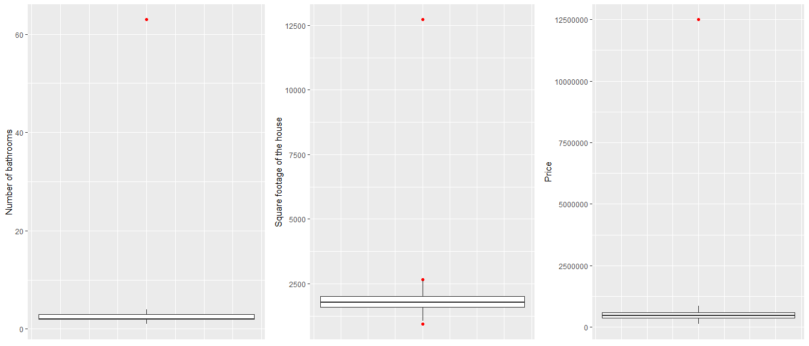
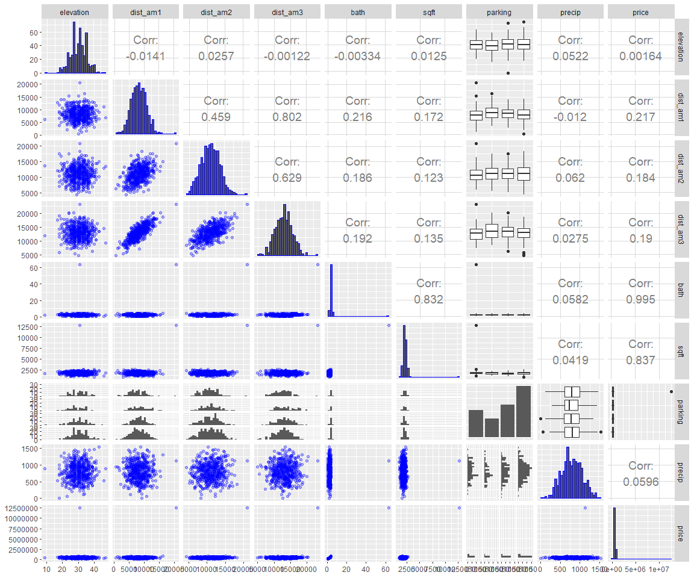
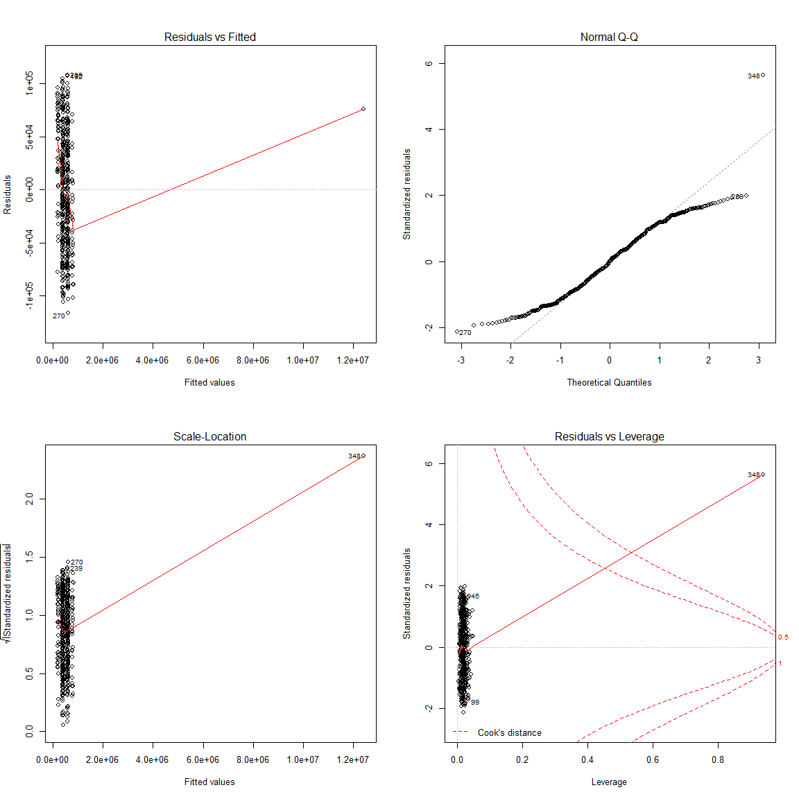
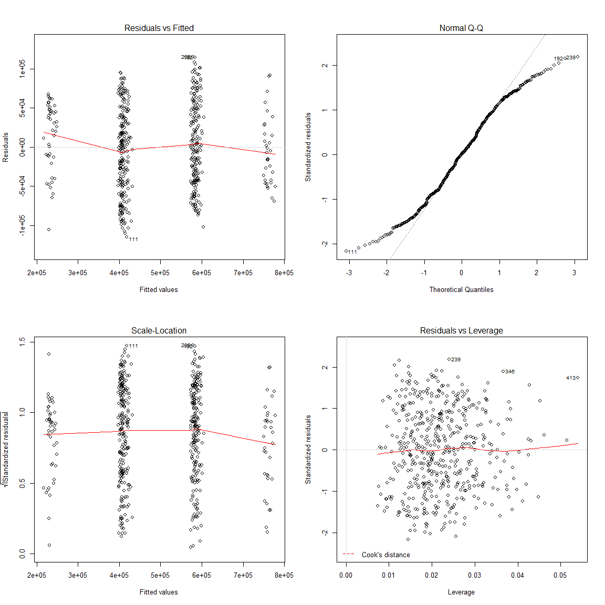
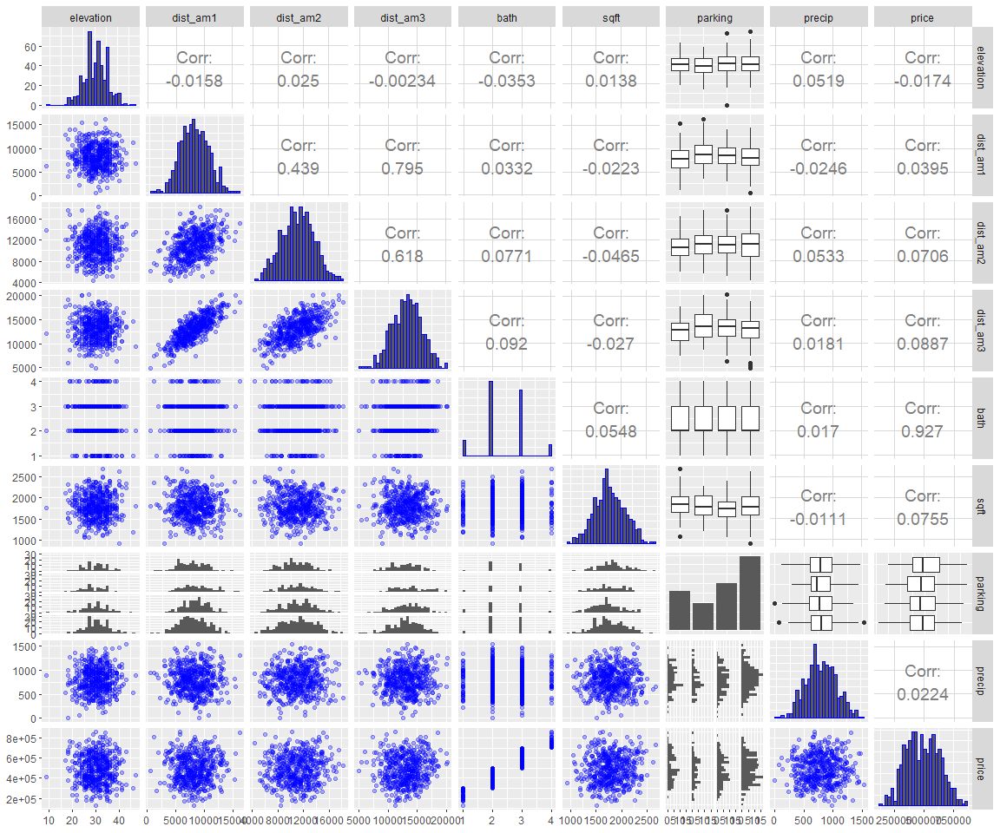
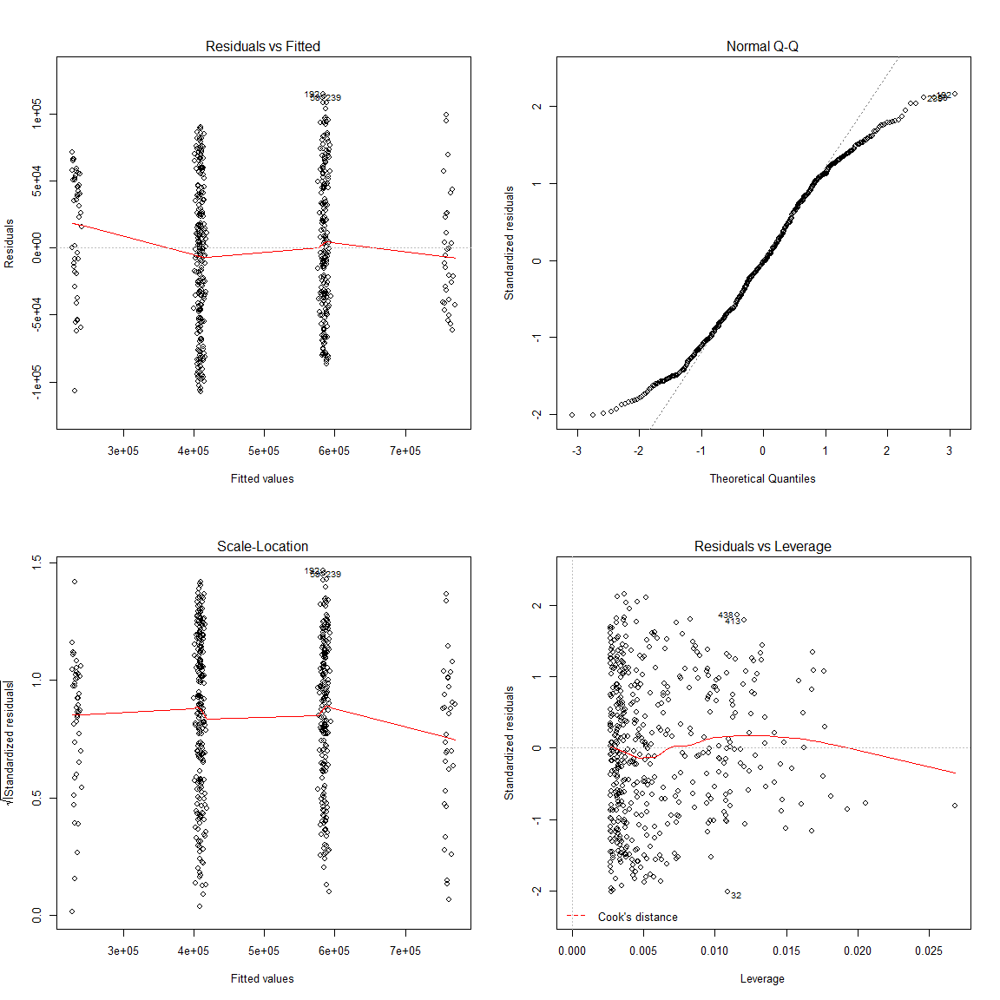
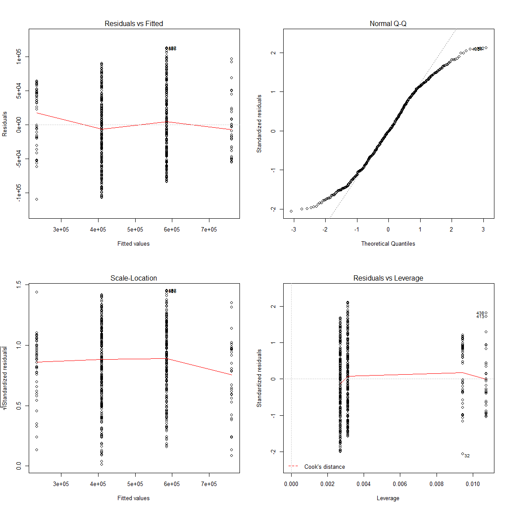

House Prices Prediction Using Linear Regression
================
Tetiana Stroganova
22/03/2019

## Introduction

The goal of the project is to predict the sale price of houses from
house sale advertisements currently in the market, using a linear
regression model.

The data set contains 500 sales with the following parameters:

  - elevation: Elevation of the base of the house
  - dist\_am1: Distance to Amenity 1
  - dist\_am2: Distance to Amenity 2
  - dist\_am3: Distance to Amenity 3
  - bath: Number of bathrooms
  - sqft: Square footage of the house
  - parking: Parking type
  - precip: Amount of precipitation
  - price: Final House Sale Price

## 1\. Exploratory analysis

Let’s have a look at the summary of the data set:

    ##    elevation        dist_am1        dist_am2        dist_am3    
    ##  Min.   : 9.00   Min.   :  604   Min.   : 4402   Min.   : 4922  
    ##  1st Qu.:27.00   1st Qu.: 6440   1st Qu.: 9229   1st Qu.:11216  
    ##  Median :30.00   Median : 8219   Median :11015   Median :13188  
    ##  Mean   :30.27   Mean   : 8258   Mean   :11037   Mean   :13093  
    ##  3rd Qu.:34.00   3rd Qu.:10011   3rd Qu.:12848   3rd Qu.:14776  
    ##  Max.   :47.00   Max.   :20662   Max.   :20945   Max.   :23294  
    ##       bath             sqft               parking        precip      
    ##  Min.   : 1.000   Min.   :  932   Covered     :105   Min.   :-110.0  
    ##  1st Qu.: 2.000   1st Qu.: 1588   No Parking  : 73   1st Qu.: 610.0  
    ##  Median : 2.000   Median : 1770   Not Provided:126   Median : 790.0  
    ##  Mean   : 2.558   Mean   : 1816   Open        :196   Mean   : 793.2  
    ##  3rd Qu.: 3.000   3rd Qu.: 2003                      3rd Qu.: 980.0  
    ##  Max.   :63.000   Max.   :12730                      Max.   :1530.0  
    ##      price         
    ##  Min.   :  124333  
    ##  1st Qu.:  380271  
    ##  Median :  481042  
    ##  Mean   :  510509  
    ##  3rd Qu.:  593750  
    ##  Max.   :12500000

We can see that there is an odd observation with a negative figure for
precipitation variable. As the precipitation cannot be negative, we need
to exclude this line from our data.

We can also see that for the number of bathrooms, square footage of
house and price variables the maximum values are much higher than the
3rd quantile figures. Let us visualise these extreme values on the
corresponding boxplots:

Let’s now use the pairs plot to visualise the relationship between all
the variables and to identify any explanatory variables correlating
between them:

As demonstrated by the pairs plot, all the graphs of explanatory
vs. response variables show an odd pattern, there is one point standing
very far from the others and there is no visible linear relationship
between the explanatory variables and the response one. The pairs graphs
confirm the presence of a potential outlier for price, square footage of
the house and number of bathrooms parameters. It can be also seen from
the graphs that the three explanatory variables reflecting the distance
to amenities strongly positively correlate between each other. The
square footage of the house positively correlates with the number of the
bathrooms, but the pattern seems to be affected by one extreme point.

## 2\. Model diagnostics and outlier detection

Let’s start with the most general linear model including all the
variables:

    ## 
    ## Call:
    ## lm(formula = price ~ ., data = dataprice)
    ## 
    ## Residuals:
    ##     Min      1Q  Median      3Q     Max 
    ## -116045  -46172    1093   43911  107962 
    ## 
    ## Coefficients:
    ##                       Estimate Std. Error t value Pr(>|t|)    
    ## (Intercept)         -4.001e+04  2.377e+04  -1.683 0.092970 .  
    ## elevation            4.942e+02  4.788e+02   1.032 0.302450    
    ## dist_am1             1.928e+00  1.623e+00   1.188 0.235314    
    ## dist_am2            -2.782e-02  1.243e+00  -0.022 0.982156    
    ## dist_am3            -1.270e+00  1.816e+00  -0.699 0.484655    
    ## bath                 1.917e+05  1.609e+03 119.136  < 2e-16 ***
    ## sqft                 2.791e+01  7.838e+00   3.562 0.000405 ***
    ## parkingNo Parking   -1.264e+04  8.584e+03  -1.472 0.141557    
    ## parkingNot Provided -5.383e+03  7.410e+03  -0.726 0.467917    
    ## parkingOpen         -1.211e+04  6.732e+03  -1.799 0.072711 .  
    ## precip               4.106e+00  9.233e+00   0.445 0.656709    
    ## ---
    ## Signif. codes:  0 '***' 0.001 '**' 0.01 '*' 0.05 '.' 0.1 ' ' 1
    ## 
    ## Residual standard error: 55160 on 488 degrees of freedom
    ## Multiple R-squared:  0.9904, Adjusted R-squared:  0.9902 
    ## F-statistic:  5014 on 10 and 488 DF,  p-value: < 2.2e-16

As we can see from the initial model summary, the number of bathrooms
and square footage of house variables seem to have a significant
relationship with the response, but let’s check the assumptions of the
model:

  - Residuals vs. Fitted - there is one fitted value standing very far
    from the rest of the points, on the far right part of the graph
    which creates an odd pattern, the red line which should be roughly
    horizontal and close to zero, goes steeply down and then up again.
    This indicates the nonconstancy of the variance, we will probably
    need to exclude the outlier (if the point is an outlier) or carry
    out a transformation to fix this.

  - Normal Q-Q plot - the 348 row stands out of the main curve, it will
    probably need to be excluded from the model.

  - Scale-Location plot - the Fitted values vs. standardized residuals
    plot shows the similar pattern to Residuals vs. Fitted plot and
    confirms that the 348 will probably need to be excluded from the
    model.

  - Cook’s distance - finally, the Cook’s distance on the Residuals
    vs. Leverage graph confirms that the row 348 should be excluded.

To confirm our choice of the outlier formally, let’s carry out the
Bonferroni outliers test:

    ##     rstudent unadjusted p-value Bonferroni p
    ## 348 5.811418         1.1207e-08   5.5925e-06

The test gives us the same result, so the row 348 should be excluded
from the data.

Let’s analyse the residuals plots again to see if the removal of the
outlier fixed the violations of the assumptions.

  - Residuals vs. Fitted - the removal of the outlier has fixed the
    problem of nonconstancy in the variance, there is no need for
    transformation.

  - Normal Q-Q plot - the plot shows a short-tailed distribution: the
    pattern corresponds to the theoretical line in the center, but the
    points are above the line in the bottom left part and under the line
    in the top right part.

  - Scale-Location plot - the plot confirms that the variance of the
    residuals is constant (roughly horizontal red line).

  - Cook’s distance - the plot shows that there are no outliers in the
    data.

Let’s have a look at the pairs plot again to see if the patterns have
changed after the outlier removal.

As shown by the pairs plot, the removal of the outlier has modified the
relationship of the square footage of the house and the number of
bathrooms parameters, they are not correlated anymore (the correlation
coefficient has decreased from 0.83 to 0.05). The response variable
appears to be highly positively correlated with the number of the
bathrooms.

## 3\. Model Selection

Using the stepwise model selection method (step() function in R), we
narrow down the model to two explanatory variables: number of bathrooms
and square footage of the house.

Let’s check the residuals plots:

  - Residuals vs. Fitted - there is no problem of nonconstancy in the
    variance, the red line is roughly horizontal

  - Normal Q-Q plot - the plot shows a short-tailed distribution with
    good fit for the majority of the points and more distant points on
    the tails. As the consequences of non-normality for short-tailed
    distributions are not serious, they can be ignored.

  - Scale-Location plot - it confirms that there is no major problem
    with nonconstance of the variance (roughly horizontal red line).

  - Residuals vs. Leverage plot - it indicates that there are no
    outliers in the model.

Let’s now check the significance of the explanatory variables, using the
model summary:

    ## 
    ## Call:
    ## lm(formula = price ~ bath + sqft, data = dataprice)
    ## 
    ## Residuals:
    ##     Min      1Q  Median      3Q     Max 
    ## -107166  -41815    -980   44432  114466 
    ## 
    ## Coefficients:
    ##              Estimate Std. Error t value Pr(>|t|)    
    ## (Intercept) 3.780e+04  1.621e+04   2.332   0.0201 *  
    ## bath        1.754e+05  3.198e+03  54.845   <2e-16 ***
    ## sqft        1.183e+01  8.053e+00   1.469   0.1424    
    ## ---
    ## Signif. codes:  0 '***' 0.001 '**' 0.01 '*' 0.05 '.' 0.1 ' ' 1
    ## 
    ## Residual standard error: 53300 on 495 degrees of freedom
    ## Multiple R-squared:  0.8595, Adjusted R-squared:  0.8589 
    ## F-statistic:  1514 on 2 and 495 DF,  p-value: < 2.2e-16

From the summary output, we can see that the p-value for the square
footage of the house variable is more than 0.05 (0.1424). This indicates
that the relationship between this variable and the response is not
significant.

Before concluding anything, let’s check the confidence intervals:

    ##                     2.5 %       97.5 %
    ## (Intercept)   5948.113478  69661.54546
    ## bath        169095.245195 181660.79827
    ## sqft            -3.989392     27.65496

The confidence interval for the number of bathrooms variable does not
contain 0 (169095,181661), so the relationship between this explanatory
variable and the response is significant. However, the confidence
interval for the square footage of the house variable contains 0
(-3.99,27.7), so the relationship between this variable and the price is
not significant. We need to drop this variable, but let’s check the
single models first.

#### Single model - number of bathrooms vs. price

    ## 
    ## Call:
    ## lm(formula = price ~ bath, data = dataprice)
    ## 
    ## Residuals:
    ##     Min      1Q  Median      3Q     Max 
    ## -109705  -42045    -850   44527  112608 
    ## 
    ## Coefficients:
    ##             Estimate Std. Error t value Pr(>|t|)    
    ## (Intercept)    58403       8157   7.159 2.94e-12 ***
    ## bath          175635       3197  54.944  < 2e-16 ***
    ## ---
    ## Signif. codes:  0 '***' 0.001 '**' 0.01 '*' 0.05 '.' 0.1 ' ' 1
    ## 
    ## Residual standard error: 53370 on 496 degrees of freedom
    ## Multiple R-squared:  0.8589, Adjusted R-squared:  0.8586 
    ## F-statistic:  3019 on 1 and 496 DF,  p-value: < 2.2e-16

    ##                 2.5 %    97.5 %
    ## (Intercept)  42375.14  74429.89
    ## bath        169354.80 181916.07

Both summary and confidence interval outputs confirm the significant
relationship between the number of bathrooms variable alone and price,
as p-value is less than 0.05 and the confidence interval doesn’t contain
0 (169355,181916)

#### Single model - square footage of the house vs. price

    ## 
    ## Call:
    ## lm(formula = price ~ sqft, data = dataprice)
    ## 
    ## Residuals:
    ##     Min      1Q  Median      3Q     Max 
    ## -352280 -106898   -2940  102388  376370 
    ## 
    ## Coefficients:
    ##              Estimate Std. Error t value Pr(>|t|)    
    ## (Intercept) 422282.24   38853.30  10.869   <2e-16 ***
    ## sqft            36.03      21.37   1.686   0.0924 .  
    ## ---
    ## Signif. codes:  0 '***' 0.001 '**' 0.01 '*' 0.05 '.' 0.1 ' ' 1
    ## 
    ## Residual standard error: 141700 on 496 degrees of freedom
    ## Multiple R-squared:  0.005699,   Adjusted R-squared:  0.003694 
    ## F-statistic: 2.843 on 1 and 496 DF,  p-value: 0.09242

    ##                     2.5 %       97.5 %
    ## (Intercept) 345944.900962 498619.56996
    ## sqft            -5.955644     78.01298

The square footage of the house variable alone shows no significant
relationship with price, as we can see from both confidence interval
which contains 0 (-5.96,78.01) and summary output where p-value is
greater than 0.05. As both the outcome of the confidence interval and of
the model summary suggest, the square footage of the house variable does
not have a significant relationship with the price.

Let’s check the adjusted R squared coefficient of the model before
dropping the square footage of the house variable and after:

    ## 
    ## Call:
    ## lm(formula = price ~ bath + sqft, data = dataprice)
    ## 
    ## Residuals:
    ##     Min      1Q  Median      3Q     Max 
    ## -107166  -41815    -980   44432  114466 
    ## 
    ## Coefficients:
    ##              Estimate Std. Error t value Pr(>|t|)    
    ## (Intercept) 3.780e+04  1.621e+04   2.332   0.0201 *  
    ## bath        1.754e+05  3.198e+03  54.845   <2e-16 ***
    ## sqft        1.183e+01  8.053e+00   1.469   0.1424    
    ## ---
    ## Signif. codes:  0 '***' 0.001 '**' 0.01 '*' 0.05 '.' 0.1 ' ' 1
    ## 
    ## Residual standard error: 53300 on 495 degrees of freedom
    ## Multiple R-squared:  0.8595, Adjusted R-squared:  0.8589 
    ## F-statistic:  1514 on 2 and 495 DF,  p-value: < 2.2e-16

    ## 
    ## Call:
    ## lm(formula = price ~ bath, data = dataprice)
    ## 
    ## Residuals:
    ##     Min      1Q  Median      3Q     Max 
    ## -109705  -42045    -850   44527  112608 
    ## 
    ## Coefficients:
    ##             Estimate Std. Error t value Pr(>|t|)    
    ## (Intercept)    58403       8157   7.159 2.94e-12 ***
    ## bath          175635       3197  54.944  < 2e-16 ***
    ## ---
    ## Signif. codes:  0 '***' 0.001 '**' 0.01 '*' 0.05 '.' 0.1 ' ' 1
    ## 
    ## Residual standard error: 53370 on 496 degrees of freedom
    ## Multiple R-squared:  0.8589, Adjusted R-squared:  0.8586 
    ## F-statistic:  3019 on 1 and 496 DF,  p-value: < 2.2e-16

The adj. R squared is 0.8589 for the model before dropping the square
footage of the house variable and 0.8586 after the drop. There is no
major change in adj. R squared coefficient, so we retain only one
variable - the number of the bathrooms. Let’s check the assumptions
again to ensure there are no violations:

  - Residuals vs. Fitted - no problem of nonconstant variance

  - Normal Q-Q plot - again a short-tailed distribution with good fit
    for the majority of the points and more distant points on the tails.

  - The Scale-Location plot - no problems with nonconstance of the
    variance.

  - Residuals vs. Leverage plot - no outliers in the model.

## 4\. Conclusions

The analysis of the data has shown that the number of bathrooms is the
only variable explaining the variability of the price. Even if initially
the square footage of the house was included in the model, the
confidence intervals check revealed the insignificance of the
relationship. The final model explains 85.86% of variability of the
house price and shows that for every one unit increase in the number of
bathrooms, the price increases by 175635 units on average.

In the above analysis the number of bathrooms variable has been treated
as numerical, another approach would be to include it in the model as
factor with 4 levels and explore the models with different regression
lines, with parallel regression lines and with a single regression line
(with no difference among the groups).
